

# 📚 Projeto de Sistemas — 2026/1

### Universidade Federal do Tocantins · Câmpus de Palmas

---

## 🧭 Sumário

| # | Seção |
|---|-------|
| 1️⃣ | [Sobre a Disciplina Projeto de Sistemas](#1--sobre-a-disciplina) |
| 2️⃣ | [Prof. Edeilson Milhomem da Silva](#2--professor-responsável-edeilson-milhomem-da-silva) |
| 3️⃣ | [Notícias e Reconhecimentos](#3--notícias-e-reconhecimentos) |
| 4️⃣ | [Participação e Conquistas na Competição Supernova no Sebrae](#4--participação-e-conquistas-na-competição-supernova-sebrae) |
| 5️⃣ | [Treinamento de Pitch com Feedback do SEBRAE](#5--treinamento-de-pitch-com-feedback-do-sebrae) |
| 6️⃣ | [Startup-SE](#6--startup-se) |
| 7️⃣ | [Projetos das startups](#7--projetos-das-startups) |
| &nbsp;&nbsp;↳ | [Grupo 1 — OwnMyWay](#71--startup-ownmyway) |
| &nbsp;&nbsp;↳ | [Grupo 2 — TimerBook](#72--startup-timerbook) |
| &nbsp;&nbsp;↳ | [Grupo 3 — Lava-me](#73--startup-lava-me) |
| &nbsp;&nbsp;↳ | [Grupo 4 — Vibeevents](#74--startup-vibeevents) |
| &nbsp;&nbsp;↳ | [Grupo 5 — Superdott](#75--startup-superdott) |
| &nbsp;&nbsp;↳ | [Grupo 6 — Unicarona](#76--startup-unicarona) |

---

## 1. 📘 Sobre a Disciplina

> A disciplina **Projeto de Sistemas** é ofertada no 5º período do curso de Bacharelado em Ciência da Computação do Câmpus de Palmas da UFT.

A disciplina tem como proposta envolver os estudantes em um processo prático e dinâmico de desenvolvimento de soluções inovadoras, startups e produtos de software, por meio da aplicação de metodologias ativas e práticas profissionais de engenharia de software. Na disciplina, os estudantes participam de todas as etapas do processo de construção da solução, desde a identificação de problemas e ideação até a validação e apresentação final no formato de pitch durante o evento Startup-SE.

---

## 2. 👤 Professor Responsável: Edeilson Milhomem da Silva

O prof. Edeilson Milhomem da Silva é doutor em Ciência da Computação e professor do Curso de Bacharelado em Ciência da Computação da UFT. Atua na promoção de iniciativas que aproximam academia e mercado, com foco em inovação, empreendedorismo tecnológico e engenharia de software. Em 2026, recebeu do SEBRAE o prêmio "Professor Empreendedor". É coautor do livro *Sistemas Colaborativos*, obra reconhecida nacionalmente na área e premiada com o 3º lugar no Prêmio Jabuti 2012, na categoria Tecnologia e Informática. Também é cofundador do Movimento Startup Tocantins, iniciativa voltada ao fortalecimento do ecossistema de inovação e empreendedorismo no estado do Tocantins. Coordena o Laboratório EPIC de Aprendizagem Colaborativa, espaço dedicado à inovação, metodologias ativas e desenvolvimento de competências empreendedoras. No EPIC, lidera projetos voltados à criação de soluções tecnológicas alinhadas às demandas reais da sociedade e do setor produtivo.

---

## 3. 📰 Notícias e Reconhecimentos

<table width="100%">
<tr>
<td width="350" align="center" valign="middle">

<a href="https://www.instagram.com/p/DaD06Dzic3z/">
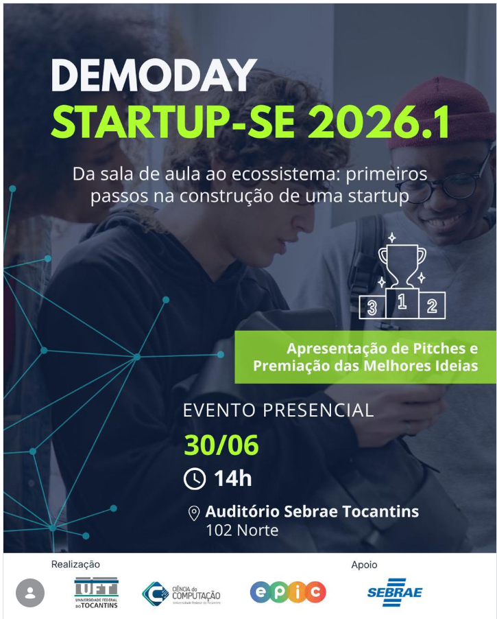
</a>

</td>
<td valign="middle">

### 📣 Convite — StartupSE 2026/1

`📅 2026` · `📷 Instagram`

O Câmpus UFT Palmas publicou nas redes sociais o convite de participação para o **StartupSE 2026/1**.

</td>
</tr>
</table>

<table width="100%">
<tr>
<td width="350" align="center" valign="middle">

<a href="https://www.instagram.com/reel/DaGcBj5RIKr/">
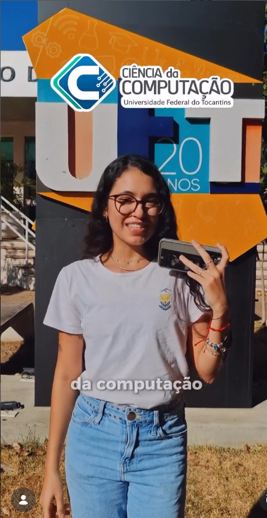
</a>

</td>
<td valign="middle">

### 🎬 Reel de Divulgação — StartupSE 2026/1

`📅 2026` · `🎥 Instagram Reels`

Reel produzido pelos alunos para divulgar o evento, apresentando um resumo de tudo o que o **StartupSE 2026/1** terá.

</td>
</tr>
</table>

<table width="100%">
<tr>
<td width="350" align="center" valign="middle">

<a href="https://www.uft.edu.br/noticias/demoday-startup-se-reune-estudantes-e-ecossistema-de-inovacao-para-apresentacao-de-startups-desenvolvidas-na-uft">
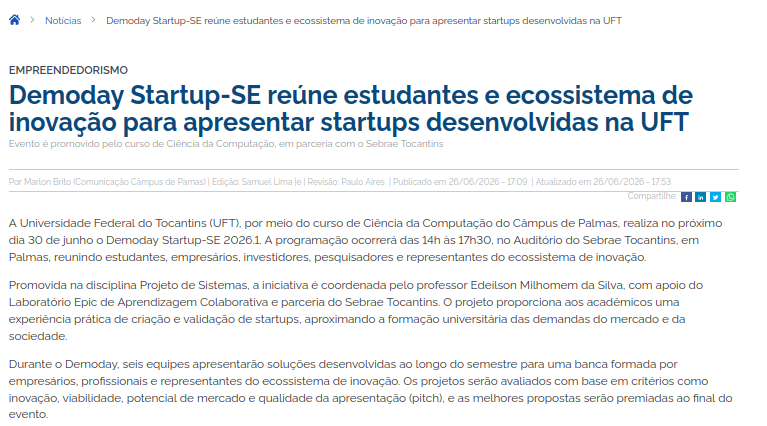
</a>

</td>
<td valign="middle">

### 🏛️ Demoday Startup-SE no Portal da UFT

`📅 2026` · `📰 Portal UFT`

**Demoday Startup-SE reúne estudantes e ecossistema de inovação para apresentar startups desenvolvidas na UFT.** Evento promovido pelo curso de Ciência da Computação, em parceria com o **Sebrae Tocantins**.

</td>
</tr>
</table>

<table width="100%">
<tr>
<td width="350" align="center" valign="middle">

<a href="https://to.agenciasebrae.com.br/inovacao-e-tecnologia/startup-se-realiza-competicao-de-inovacao-entre-universitarios-em-palmas/">
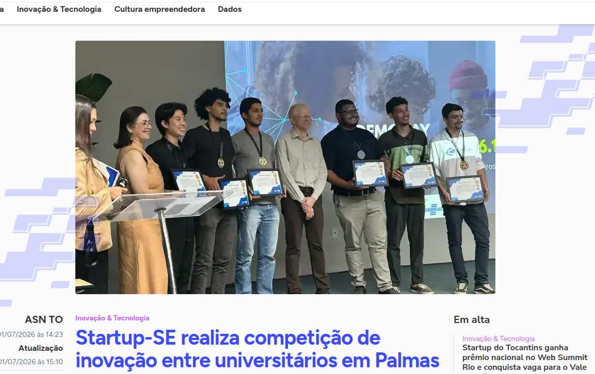
</a>

</td>
<td valign="middle">

### 🏢 Startup-SE no Portal do Sebrae

`📅 2026` · `📰 Agência Sebrae`

**Startup-SE realiza competição de inovação entre universitários em Palmas.** Projeto desenvolvido pela UFT em parceria com o Sebrae incentiva empreendedorismo, criatividade e resolução de problemas por meio de desafios práticos.

</td>
</tr>
</table>

## 4. 🎤 Participação e Conquistas na Competição Supernova Sebrae

Os projetos de startups desenvolvidos participaram da competição Sebrae Supernova. O Sebrae Supernova é um programa do Sebrae, em parceria com o Ministério da Educação (MEC), que objetiva ensinar a transformar ideias acadêmicas em negócios de alto impacto.

### 4.1 Participação na Final Estadual

> _[Listar Times se Houver]_

### 4.2 Campeão Estadual e Finalista Nacional

> _[Inserir Time se Houver]_

---

## 5. 🎯 Treinamento de Pitch com Feedback do SEBRAE

Como parte das atividades da disciplina, todos os grupos estiveram presencialmente no **SEBRAE Tocantins** para apresentar o pitch de seus negócios a uma banca avaliadora. Na ocasião, cada equipe expôs sua proposta de solução e recebeu feedback dos avaliadores, que apontaram pontos fortes e oportunidades de melhoria em cada projeto — um treinamento prático que preparou as equipes para a apresentação final no Startup-SE.

A atividade reforça a parceria entre o **SEBRAE Tocantins** e a **UFT** no apoio ao empreendedorismo acadêmico: ao abrir suas instalações e disponibilizar uma banca para avaliar os trabalhos, o SEBRAE contribuiu diretamente para o amadurecimento das ideias e para o desenvolvimento das competências de apresentação das equipes.

### 📸 Registros

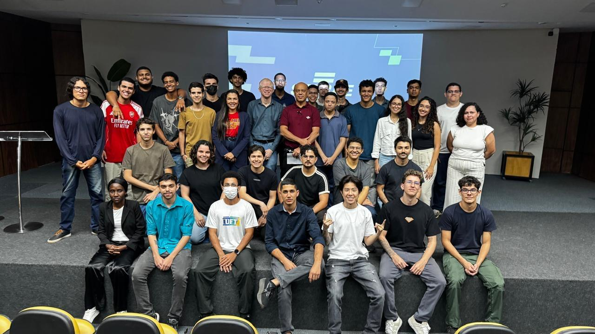
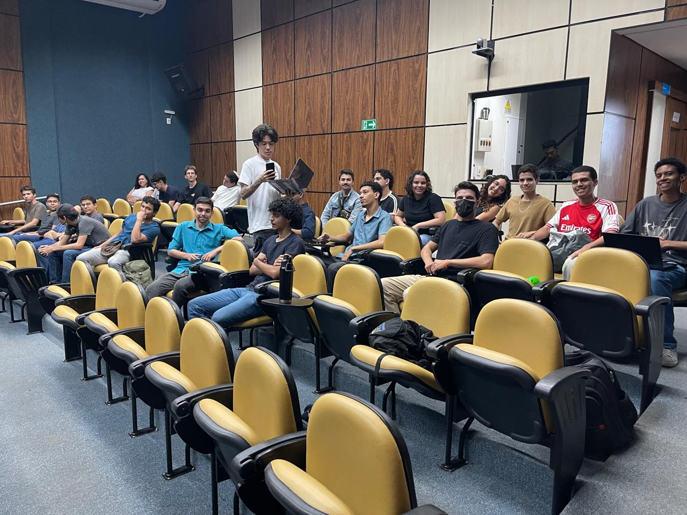
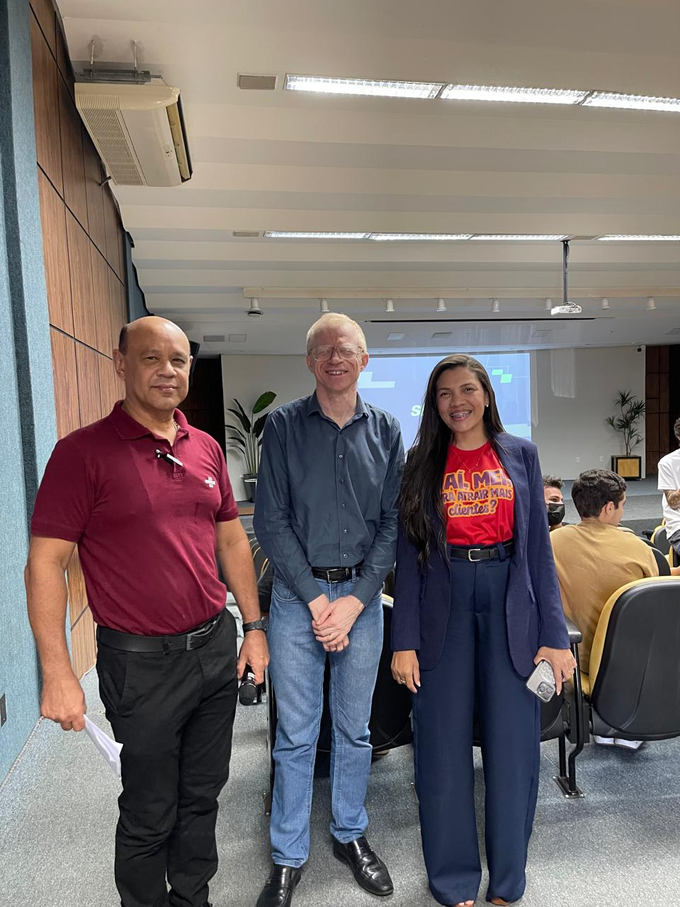

---

## 6. 💡 Startup-SE

O **Startup-SE** é o evento de encerramento da disciplina Projeto de Sistemas, realizado em parceria entre a **UFT** e o **SEBRAE Tocantins**, no auditório do SEBRAE, em Palmas. Ao longo do semestre, os alunos da disciplina conceberam e desenvolveram projetos de startups — da identificação do problema à construção do produto — e, no evento, cada equipe apresentou seu pitch a uma banca avaliadora e ao público presente.

Além das apresentações, o evento contou com uma premiação: os projetos foram avaliados e os **três melhores** receberam destaque no **Top 3** da turma, reconhecendo as soluções com maior potencial de negócio e qualidade de execução. Mais do que uma avaliação final, o Startup-SE consolida a ponte entre a academia e o ecossistema de inovação do Tocantins, dando visibilidade ao trabalho dos estudantes diante de representantes do mercado.

**🏆 Top 3 — Startup-SE 2026/1**

- 🥇 **1º lugar:** [UniCarona](#76--startup-unicarona)
- 🥈 **2º lugar:** [OwnMyWay](#71--startup-ownmyway)
- 🥉 **3º lugar:** [Superdott](#75--startup-superdott)

### 🖼️ Banner de Divulgação

### 📸 Fotografias do Evento

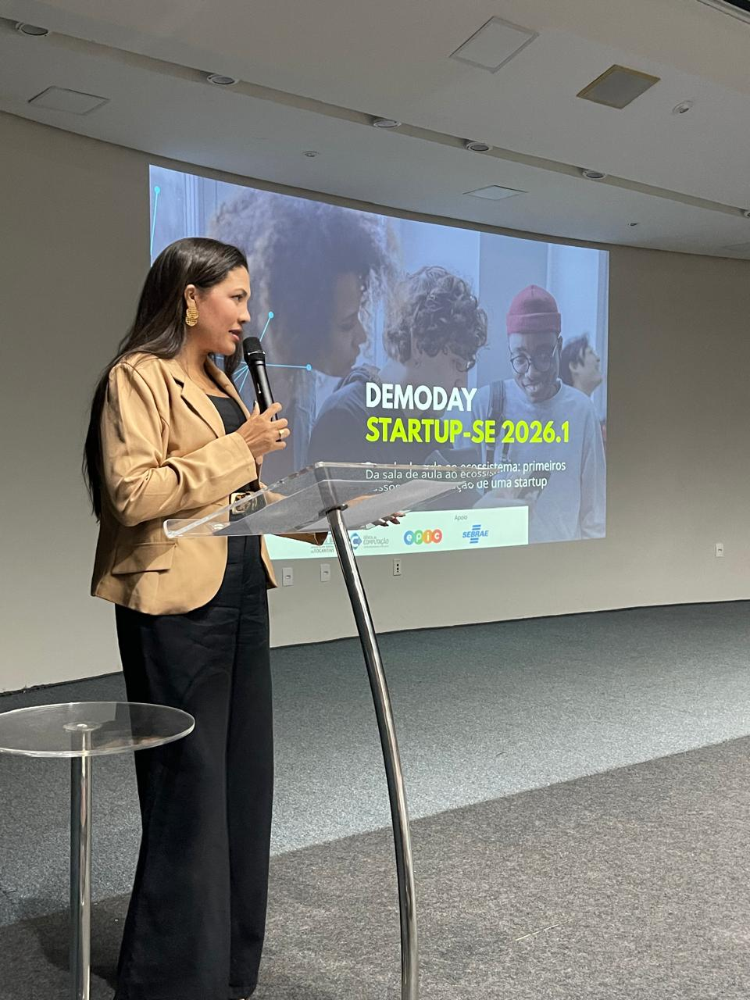
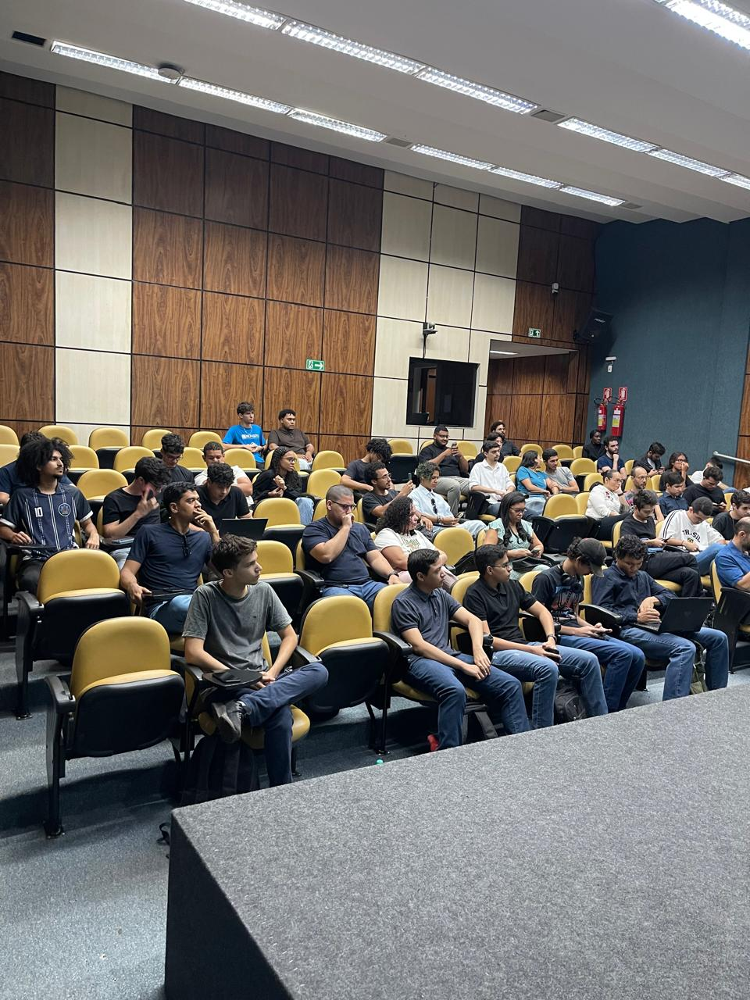
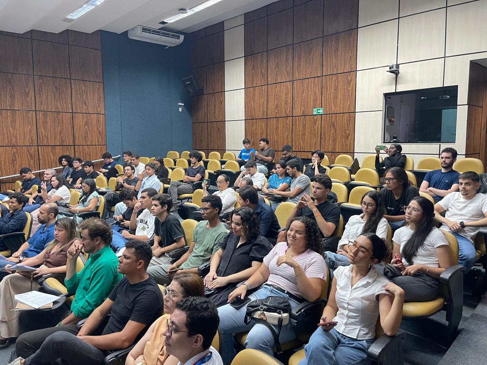
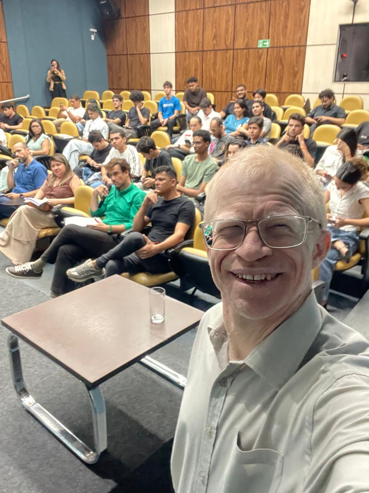
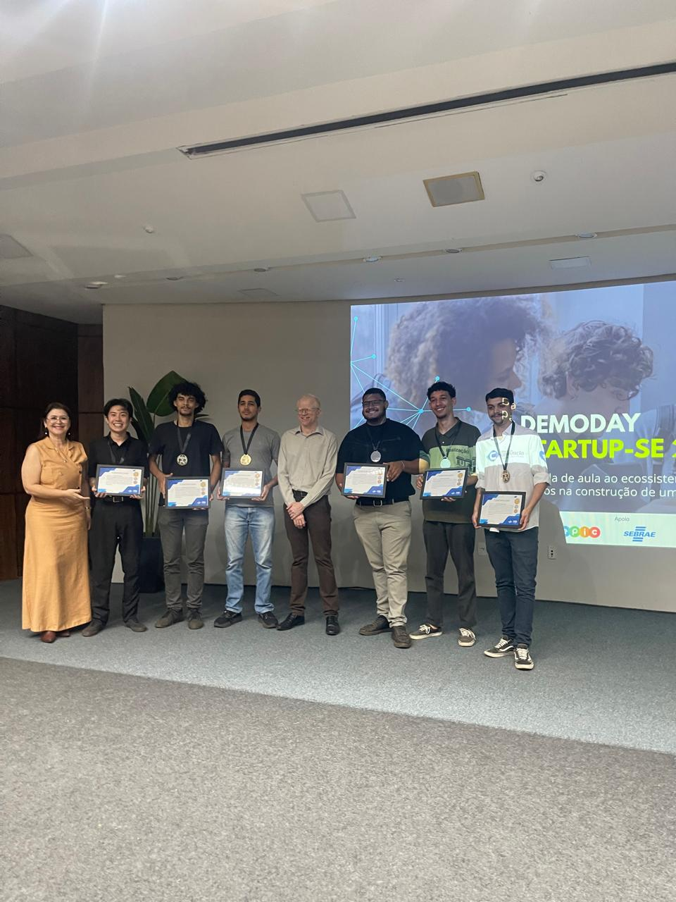

## 7. 🛠 Projetos das Startups

---

### 7.1 🚀 StartUP OwnMyWay

#### 📝 Descrição do Produto

O **OwnMyWay** é um aplicativo mobile de turismo personalizado que:

- Cria roteiros de viagem únicos baseados em hobbies, ritmo e orçamento do usuário
- Utiliza inteligência artificial (Gemini 2.0) para análise visual e recomendações em tempo real
- Estima gasto real por local e total da rota com heurística por tipo de lugar
- Funciona completamente offline com mapas OpenStreetMap para qualquer destino
- Permite salvar rotas personalizadas com nome e descrição para reutilização
- Oferece rede social integrada com sistema de amizades e feed de atividades
- Utiliza algoritmo inteligente que otimiza trajeto via Google Directions API

**Stack:**

#### 👥 Integrantes

| Nome | GitHub |
|------|--------|
| João Pedro Felix Veloso | [@FelixJP23](https://github.com/FelixJP23) |
| Artur Anderson Alves Corrêa | [@ArturML01](https://github.com/ArturML01) |
| Giovana Torres de Lima Silva | [@F4RFALLA](https://github.com/F4RFALLA) |
| Ricardo Pereira Rodrigues de Carvalho | [@devricardorodrigues](https://github.com/devricardorodrigues) |
| Lean de Albuquerque Pereira | [@LeanAlbu](https://github.com/LeanAlbu) |

#### 📦 Repositórios

🔗 [Repositório do app](https://github.com/FelixJP23/OwnMyWay)

#### 📑 Documentação Técnica

| Item | Link |
|------|------|
| Landing Page | [Acesse aqui](https://felixjp23.github.io/OwnMyWay/) |
| Apresentação do Pitch(Slide) | 🔜 _Será adicionada em breve_ <!-- substituir por: [Ver apresentação](COLE_O_LINK_AQUI) --> |
| Vídeo do Pitch | 🔜 _Será adicionado em breve_ <!-- substituir por: [Assistir ao pitch](COLE_O_LINK_AQUI) --> |
| Apresentação Técnica | [Apresentação](https://github.com/FelixJP23/OwnMyWay/blob/main/Apresentac%C3%A3o_tecnica.pdf) |
| Vídeo de Demonstração | [Vídeo](https://www.youtube.com/watch?v=Flz4_X3lE1Q) |
| Download do APK | [APK](https://github.com/FelixJP23/OwnMyWay/releases/tag/1.5) |

#### 📸 Foto da Equipe (Startup-SE)

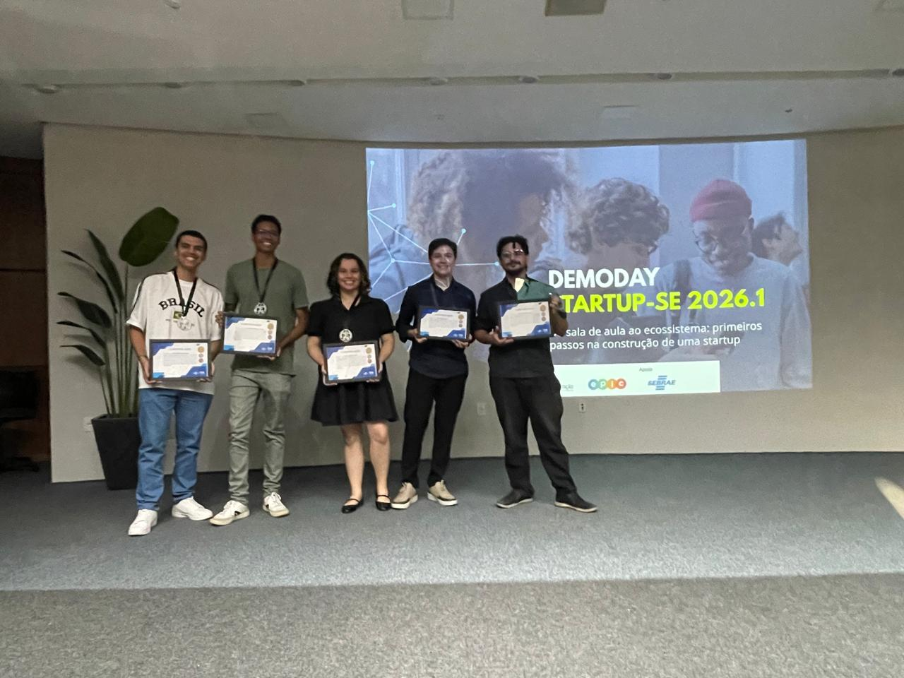 

---

### 7.2 🚀 StartUP TimerBook

#### 📝 Descrição do Produto

O **TimerBook** é uma aplicação **web e mobile** de biblioteca virtual pessoal que:

- 📖 Permite adicionar e ler seus próprios livros em um leitor totalmente integrado
- 🤖 Conta com uma **IA de contexto ativo** que resume e explica o conteúdo da página exata em tempo real
- 🎯 Transforma a leitura em hábito gamificado, com sistema de metas diárias e conquistas
- 📊 Gera relatórios e análises de desempenho de leitura no perfil do usuário
- ☁️ Mantém a biblioteca sincronizada entre os ambientes web e mobile

**Stack:**

#### 👥 Integrantes

| Nome | GitHub |
|------|--------|
| Lucas Monteiro de Carvalho | [@lucas-mcarvalho](https://github.com/lucas-mcarvalho) |
| Tiago Barbosa de Castro Souza | [@TiagoBrs](https://github.com/TiagoBrs) |
| Matheus Silva Pontes | [@matheuspontes01](https://github.com/matheuspontes01) |
| Bruno Henrique Frota Sobral | [@Bruno-uft](https://github.com/Bruno-uft) |
| Vitor Kawan Barbosa Borges | [@KawanVitor1](https://github.com/KawanVitor1) |
| Kayke Zago Pinheiro | [@kayke002](https://github.com/kayke002) |

#### 📦 Repositórios

🔗 [Repositório Web](https://github.com/lucas-mcarvalho/TimerBook_PS) | [Repositório Mobile](https://github.com/lucas-mcarvalho/TimerBookMobile)

#### 📑 Documentação Técnica

| Item | Link |
|------|------|
| Landing Page | [Acesse aqui](https://lucas-mcarvalho.github.io/TimerBook_PS/) |
| Apresentação do Pitch(Slide) | [Ver apresentação](https://github.com/lucas-mcarvalho/TimerBook_PS/raw/main/docs/apresentacao_pitch.pdf)  |
| Vídeo do Pitch | 🔜 _Será adicionado em breve_ <!-- substituir por: [Assistir ao pitch](COLE_O_LINK_AQUI) --> |
| Vídeo de Demonstração |  [Assistir à demo](https://youtu.be/IpGd2R0_AH8) |
| Apresentação Técnica | [Ver apresentação](https://raw.githubusercontent.com/lucas-mcarvalho/TimerBook_PS/main/docs/apresentacao_tecnica.pdf) |
| Download do APK |  [Baixar APK](https://raw.githubusercontent.com/lucas-mcarvalho/TimerBookMobile/main/timerbook.apk) |

#### 📸 Foto da Equipe (Startup-SE)

  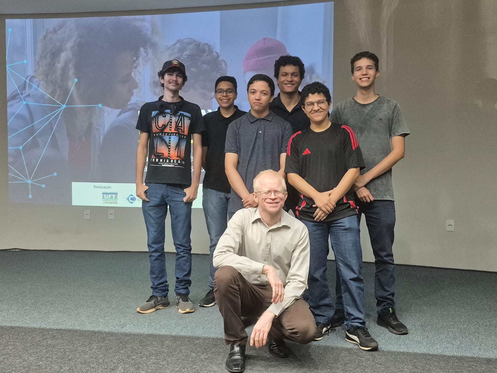 

---

### 7.3 🚀 StartUP Lava-me

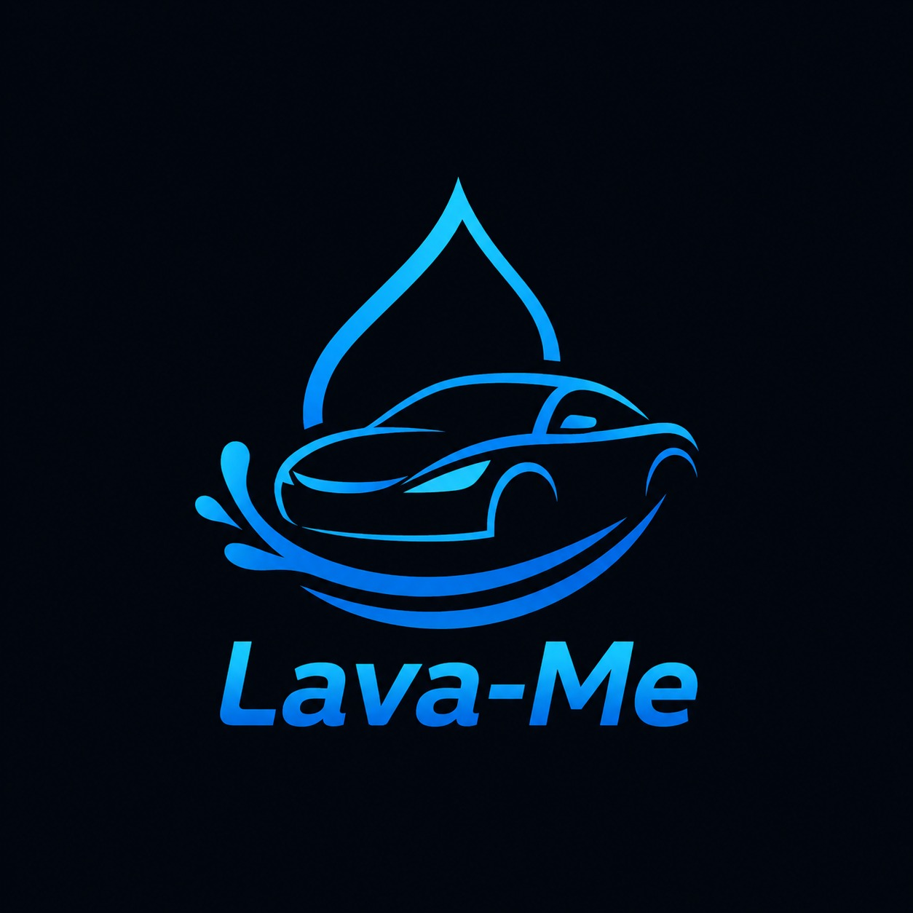

#### 📝 Descrição do Produto

O **Lava-Me** é um aplicativo mobile que conecta clientes a lava-jatos parceiros próximos e digitaliza a operação completa do estabelecimento, permitindo:

- 📍 Descobrir lava-jatos no mapa interativo e agendar uma lavagem em menos de 2 minutos, com horários reais baseados na disponibilidade do estabelecimento
- 🚗 Acompanhar o veículo em tempo real — o cliente vê cada etapa, do pátio à liberação, como um rastreador de pedido
- 🔔 Receber notificação e galeria de fotos do carro pronto antes de ir buscar
- 🗂️ Gerenciar a pista em tempo real com Kanban de veículos, alertas de atraso e controle de equipe pelo painel web do gestor
- 🛡️ Proteger o estabelecimento juridicamente com vistoria fotográfica obrigatória, registro de avarias e histórico auditável de cada ordem de serviço
- 💰 Controlar o financeiro com painel de receitas, histórico de transações e exportação de relatórios em PDF

#### 👥 Integrantes

| Nome | GitHub |
|------|--------|
| Letícia Gomes Pereira | [@LeticiaGLopes-151](https://github.com/LeticiaGLopes-151) |
| Maurício Monteiro de Paula Neri | [@MontDeP](https://github.com/MontDeP) |
| Heitor Fernandes Carrijo | [@HeitorFernandes04](https://github.com/HeitorFernandes04) |
| Wanderson Almeida de Mello | [@WandersonAMello](https://github.com/WandersonAMello) |
| Lucas José de Souza Gomes | [@yamatosz](https://github.com/yamatosz) |
| Marcos Vincius Barbosa e Silva | [@eziors](https://github.com/eziors) |

#### 📦 Repositórios

[Repositório do Projeto](https://github.com/HeitorFernandes04/projeto_2026_01)

#### 📑 Documentação Técnica

| Item | Link |
|------|------|
| Landing Page | [Acesse aqui](https://lava-me-landing-page.vercel.app/)|
| Apresentação do Pitch(Slide) | [Ver apresentação](Documentos_Importantes/lava-me/pitch.html)|
| Vídeo do Pitch | [Acessar video](https://drive.google.com/file/d/18OqfJpjaShEYbpqRHg632hRuYTG_VpJM/view?usp=sharing) |
| Apresentação Técnica | [Ver apresentação](Documentos_Importantes/lava-me/apresentação_tecnica.pdf) |
| Vídeo de Demonstração | 🔜 _Será adicionado em breve_ |

#### 📸 Foto da Equipe (Startup-SE)

 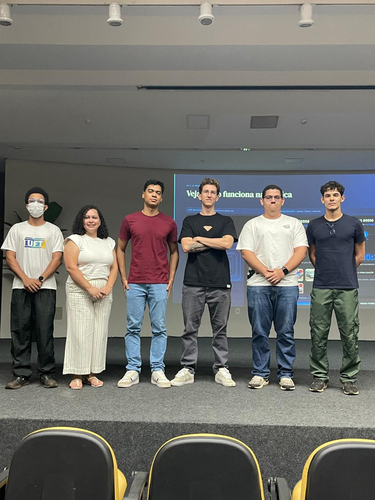 

---

### 7.4 🚀 StartUP VibeEvents

#### 📝 Descrição do Produto

O **VibeEvents** é uma plataforma de integração regional de eventos com foco em impacto social que:

- 🗺️ Conecta empreendedores locais, estudantes e ONGs por meio de um mapa interativo
- 📍 Facilita a descoberta e a integração de eventos regionais de Palmas e região
- 🤝 Promove o ecossistema cultural e o engajamento comunitário com foco social
- 📈 Fortalece a visibilidade de iniciativas e negócios de impacto local

#### 👥 Integrantes

| Nome | GitHub |
|------|--------|
| Cristian Herrera Alves | [@HerreraCris](https://github.com/HerreraCris) |
| Gabryel Soares Marques | [@GabryelMarques](https://github.com/GabryelMarques) |
| Laurinda Nhanga Mona | [@nhangamona](https://github.com/nhangamona) |
| Vinicius Fernandes Simon | [@viniciusfernandessimon](https://github.com/viniciusfernandessimon) |

#### 📦 Repositórios

🔗 [Repositório](https://github.com/HerreraCris/VibeEvents)

#### 📑 Documentação Técnica

| Item | Link |
|------|------|
| Landing Page | [Repositório](https://herreracris.github.io/VibeEvents/)|
| Apresentação do Pitch(Slide) | 🔜 _Será adicionada em breve_ <!-- substituir por: [Ver apresentação](COLE_O_LINK_AQUI) --> |
| Vídeo do Pitch | 🔜 _Será adicionado em breve_ <!-- substituir por: [Assistir ao pitch](COLE_O_LINK_AQUI) --> |
| Apresentação Técnica | [Aqui](https://github.com/HerreraCris/VibeEvents/blob/develop/static/Apresenta%C3%A7%C3%A3o%20T%C3%A9cnica) |
| Vídeo de Demonstração | [Aqui](https://github.com/HerreraCris/VibeEvents/blob/develop/static/V%C3%ADdeo%20demonstra%C3%A7%C3%A3o) |
| Download do APK | [Link](https://github.com/HerreraCris/VibeEvents/blob/develop/app-release-signed.apk) |

#### 📸 Foto da Equipe (Startup-SE)

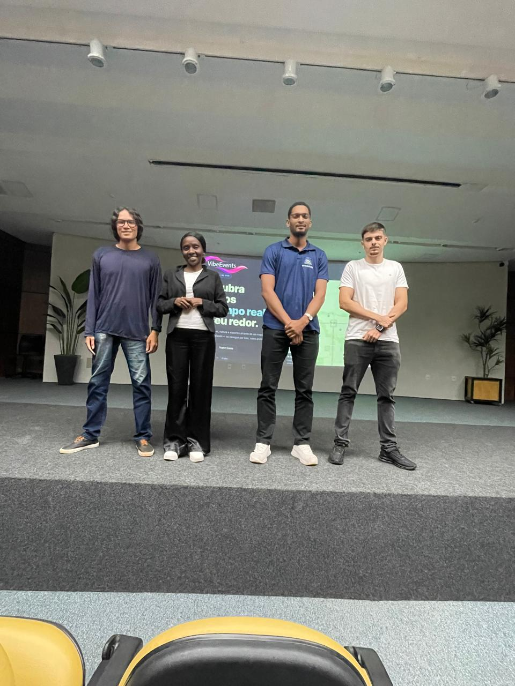 

---

### 7.5 🚀 StartUP Superdott

  

#### 📝 Descrição do Produto

O **Superdott** é uma plataforma SaaS híbrida (B2B/B2C) de gestão escolar e inteligência pedagógica, projetada exclusivamente para identificar, gerir e desenvolver alunos com Altas Habilidades ou Superdotação (AH/SD).

#### 👥 Integrantes

| Nome | GitHub |
|------|--------|
| Rhyan Nascimento de Souza | [@drgeralt](https://github.com/drgeralt) |
| Vitória Milhomem Soares | [@vitoriamilhomem](https://github.com/vitoriamilhomem) |
| Rick Ribeiro | [@rickribeiroo](https://github.com/rickribeiroo) |
| Vitoria Ferreira Leal dos Santos | [@coisacruel](https://github.com/vitorialeal06) |
| Matheus de Sousa Silva | [@math3us-sousa](https://github.com/math3us-sousa) |

#### 📦 Repositórios

🔗 [Repositório](https://github.com/drgeralt/Superdott)

#### 📑 Documentação Técnica

| Item | Link |
|------|------|
| Landing Page | [Acesse aqui](https://superdott.onrender.com/) |
| Apresentação do Pitch | [Apresentação](https://canva.link/ama8dgr1yqrnzxt) |
| Vídeo do Pitch | 🔜 _Será adicionado em breve_ <!-- substituir por: [Assistir ao pitch](COLE_O_LINK_AQUI) --> |
| Apresentação Técnica | [Apresentação](https://canva.link/vwlx330uhfc4nk7) |
| Vídeo de Demonstração |  🔜 _Será adicionado em breve_ |

#### 📸 Foto da Equipe (Startup-SE)

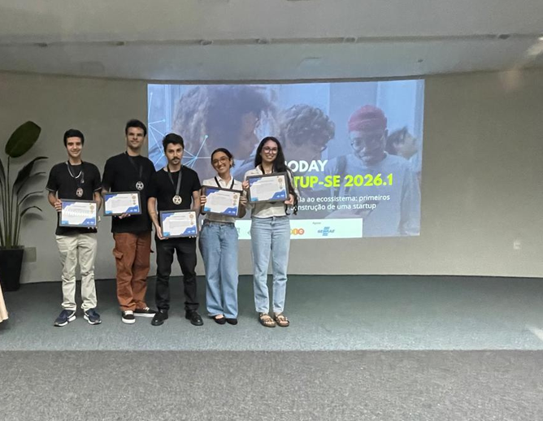 

---

### 7.6 🚀 StartUP Unicarona

#### 📝 Descrição do Produto

O **UniCarona** é uma plataforma mobile de caronas universitárias que:

- 🚗 Conecta motoristas e passageiros da mesma instituição de ensino
- 📍 Exibe caronas disponíveis no mapa com filtro geográfico (Haversine)
- 💳 Permite solicitação de vaga com checkout de pagamento integrado
- 🔔 Acompanhamento de pedidos em tempo real (long-polling)
- 🌱 Promove mobilidade sustentável e economia compartilhada

#### 👥 Integrantes

| Nome | GitHub |
|------|--------|
| Cayke Daniel Pereira Veras | [@cayke1](https://github.com/cayke1) |
| Filipe Silva Coelho | [@Purazika](https://github.com/Purazika) |
| João Pedro Oliveira Barbosa | [@Iohanan-Cephas](https://github.com/Iohanan-Cephas) |
| Gabryel Dellanne Santiago Araújo | [@dellannegabryel-commits](https://github.com/dellannegabryel-commits) |
| Lucas Gabriel Costa Farias | [@ilwca](https://github.com/ilwca) |
| Lucas Yudi Modesto | [@Yuud1](https://github.com/Yuud1) |

#### 📦 Repositórios

🔗 [Frontend](https://github.com/cayke1/Unicarona-Frontend) | [Backend](https://github.com/cayke1/UniCarona-Backend)

#### 📑 Documentação Técnica

| Item | Link |
|------|------|
| Landing Page | [Acesse aqui](https://unicarona.caykedev.com/) |
| Apresentação do Pitch(Slide) | 🔜 _Será adicionada em breve_ <!-- substituir por: [Ver apresentação](COLE_O_LINK_AQUI) --> |
| Vídeo do Pitch | 🔜 _Será adicionado em breve_ <!-- substituir por: [Assistir ao pitch](COLE_O_LINK_AQUI) --> |
| Apresentação Técnica | [Apresentação](./Unicarona//Apresentação%20Técnica.pptx) |
| Documentação Swagger | `http://[host]:3000/api-docs` |
| Vídeo de Demonstração | em breve |
| Download do APK | [APK](https://unicarona.caykedev.com/#download) |

#### 📸 Foto da Equipe (Startup-SE)

 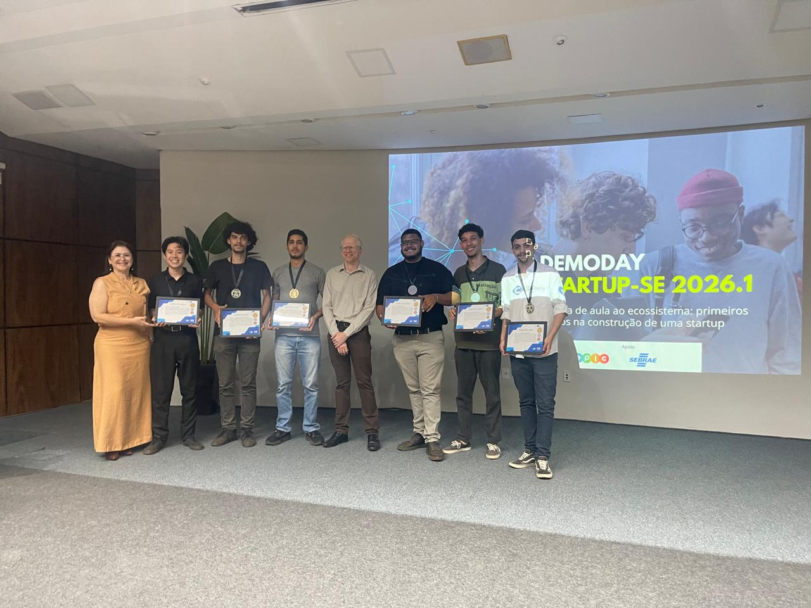 

---

## 8. ⭐ Foto da Turma

 

